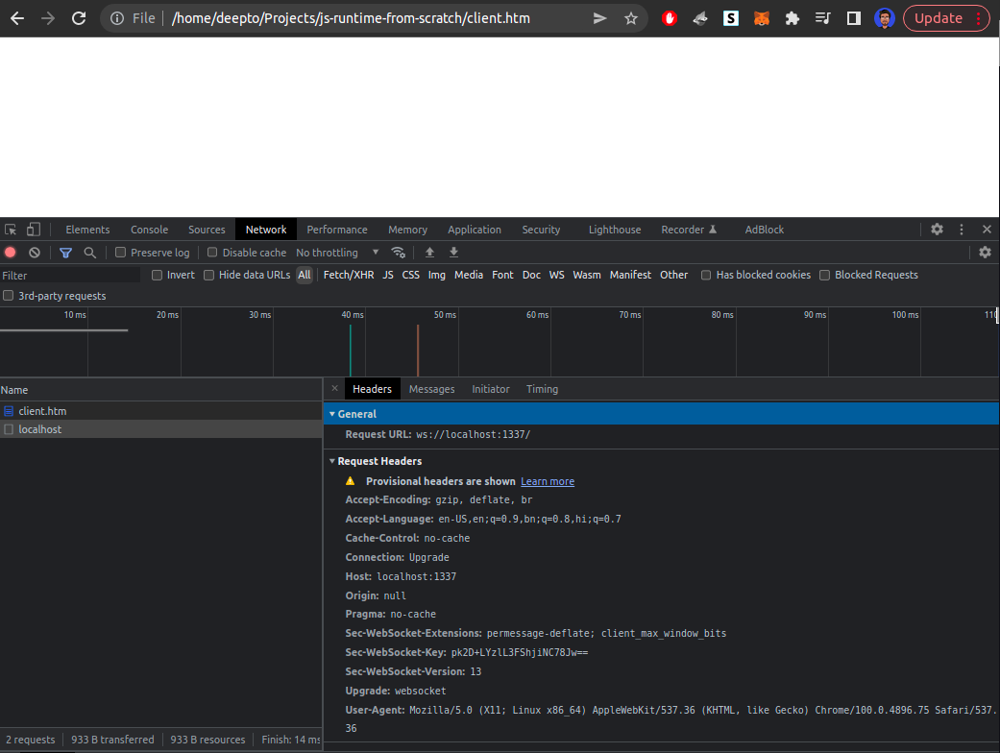

# Implementing Websockets
https://developer.mozilla.org/en-US/docs/Web/API/WebSockets_API/Writing_WebSocket_servers
1. Add WebSocket object in client with (onopen, etc events) to connect to ws server https://developer.mozilla.org/en-US/docs/Web/API/WebSocket
2. HANDSHAKE : Client pings the server, requesting a WebSocket connection, by sending a connection upgrade request with the `Sec-WebSocket-Key` header (upgrade from HTTP to websocket) ( https://developer.mozilla.org/en-US/docs/Web/HTTP/Headers/Upgrade
)
    ```http
    GET /chat HTTP/1.1
    Host: example.com:8000
    Upgrade: websocket
    Connection: Upgrade
    Sec-WebSocket-Key: dGhlIHNhbXBsZSBub25jZQ==
    Sec-WebSocket-Version: 13
    ```
    
3. To complete the HANDSHAKE, the server has to respond with a response with the `Sec-WebSocket-Accept` header  
    ```http
    HTTP/1.1 101 Switching Protocols
    Upgrade: websocket
    Connection: Upgrade
    Sec-WebSocket-Accept: s3pPLMBiTxaQ9kYGzzhZRbK+xOo=
    ```
    `From Writing WebSocket servers article: Additionally, the server can decide on extension/subprotocol requests here; see Miscellaneous for details. The Sec-WebSocket-Accept header is important in that the server must derive it from the Sec-WebSocket-Key that the client sent to it.To get it, concatenate the client's Sec-WebSocket-Key and the string "258EAFA5-E914-47DA-95CA-C5AB0DC85B11" together (it's a "magic string"), take the SHA-1 hash of the result, and return the base64 encoding of that hash.`
4. Return this response from the server to establish the websocket connection through the handshake. Next part is to send messages from the client